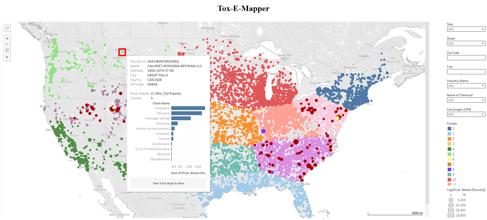

# Tox-E-Mapper

Tox-E-Mapper is an **interactive geospatial tool** that improves access to the U.S. EPA’s **Toxics Release Inventory (TRI)** data. It helps users explore where toxic chemicals are released, identify pollution hotspots, and track trends over time.

## Project Overview

* **Problem:** Existing platforms like EPA’s EnviroMapper are hard to use and don’t support advanced exploration of TRI data.
* **Goal:** Build an accessible, interactive dashboard to help policymakers, researchers, and the public make data-driven decisions about environmental health.
* **Approach:**

  * Cleaned and processed **3M+ TRI records (1987–2023)**.
  * Applied **PCA and K-Means clustering** to group facilities with similar release patterns.
  * Built an interactive **Tableau dashboard** with filters, clustering overlays, and detailed tooltips.
  * Conducted a usability evaluation — users found Tox-E-Mapper significantly easier and faster than EnviroMapper.

Below is a screenshot of the dashboard for illustrative purposes:



## Skills Demonstrated

* **Data Cleaning & Preparation**: Removing incomplete and zero-heavy features, standardizing geospatial fields.
* **Exploratory Data Analysis**: Correlation analysis, feature importance, log-scale visualizations.
* **Machine Learning**: PCA for dimensionality reduction, K-Means clustering to identify pollution hotspots.
* **Data Visualization**: Interactive Tableau dashboards with search, filters, and tooltips.
* **User Research & Evaluation**: Designed and ran a usability study comparing Tox-E-Mapper with EnviroMapper.

## Tools & Technologies

* Python (Pandas, scikit-learn) for cleaning, feature engineering, and clustering.
* Tableau for interactive dashboards.
* SQLite for lightweight data management.
* HTML, CSS, and JavaScript for deployment.

## Repository Contents

* **`Tox_e_mapper.html`** – Local HTML file to view the interactive dashboard.
* **`team060poster.pdf`** – Poster summarizing the project.
* **`team060report.pdf`** – Full project report with methods, evaluation, and results.

## How to Use the Dashboard

**Option 1 — Tableau Public:**
* Click the link attached below to Tableau Public to have a quick view of the dashboard.

**Option 2 — HTML file in browser :**

* After downloading it, double-click `Tox_e_mapper.html` to open it in your browser.

**Option 3 — Local Server:**

1. Open a terminal in this folder.
2. Run:

   ```bash
   python -m http.server 8000
   ```
3. Go to [http://localhost:8000](http://localhost:8000) in your browser.

**Navigation Tips:**

* **Hover** over points for facility, chemical, and waste details.
* **Zoom & Pan** to explore regions.
* **Filters (Sidebar):** Filter by state, industry, chemical, carcinogen classification, or cluster.
* **Search Bar:** Look up addresses or place names to check local TRI activity.

## Key Findings

* **Top predictors** of emissions included facility industry type and production waste.
* Clustering revealed **pollution hotspots** not obvious from raw TRI data.
* Users found Tox-E-Mapper easier to use and more effective for spotting trends than EPA’s EnviroMapper.

## Links

* [Tableau Public Dashboard](https://public.tableau.com/app/profile/diane.egret/viz/ClusteredMap_17440624844360/Dashboard1)
* [Demo Video](https://www.youtube.com/watch?v=nSbnjFp_rTA)

## Credits

Project completed by my teammates and myself through CSE 6242 (Data and Visual Analytics) at **Georgia Tech**:

* Diane Egret
* Arya Kalappurayil
* Cecili Poole
* Rhee Kang
